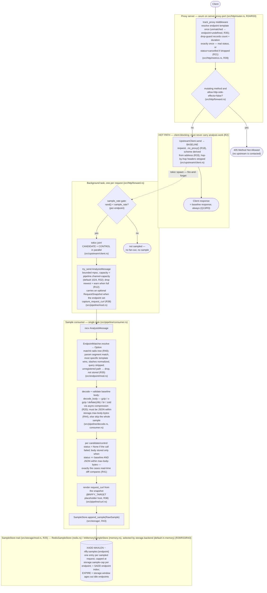
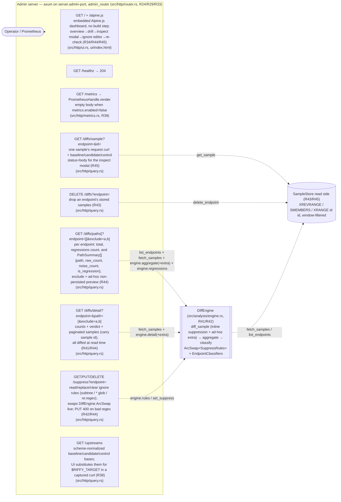

# Riffy — Runtime Architecture (DAG)

Riffy is a reverse proxy that detects statistical regressions between three
upstream deployments of the same service. Every request is answered from the
**baseline** upstream with zero analysis overhead; the **candidate** (new code)
and **control** (baseline replica) are called in the background. The producer
side does only two things: decide whether to sample a request, and — for sampled
requests — **store the raw responses of all three upstreams** as a `RawSample`
(R41). Nothing is diffed, suppressed, counted, or classified on the write side.

All analysis happens **at read time**, when the query API is hit: a `DiffEngine`
(`src/analysis/engine.rs`) diffs the stored samples on the fly, applies its
**suppression rules inline**, aggregates per-field raw/noise counts, and runs the
regression verdict. Fields where baseline-vs-candidate disagreement (**raw**)
significantly exceeds baseline-vs-control disagreement (**noise**) are flagged as
real regressions. The engine's suppression rules are **writable at runtime**
(R42): an `arc_swap::ArcSwap<SuppressRules>`, config-seeded, swapped wholesale by
the `/suppress` admin API and taking effect on the next query with no restart.

This document describes what the code *does today* and is the single source of
truth for the runtime architecture. The inline `(R#)` tags mark deliberate
design decisions made along the way — historical markers, not entries in a
separate changelog. To update this doc, use the `update-architecture-doc` skill
in `.claude/skills/`.

## Request & Sampling DAG (producer side)

Solid arrows are data flow within one request's lifecycle; the dotted arrow is
the only hand-off from the client-blocking path to async work. The graph is
acyclic. There is **no aggregation ticker and no pre-aggregation** anymore — the
consumer's only job is to persist a raw sample (R41).

## Admin server (read-time analysis + query API)

The admin server carries `AdminState { metrics, store, engine, upstreams }`
(R29/R31/R33/R42); `FromRef` hands each route only the substate it needs. On
every query the `DiffEngine` reads raw samples from the same `SampleStore` the
consumer writes to, diffs them on the fly (R41), applies its `ArcSwap`
suppression rules inline (R42), aggregates counts, and classifies — nothing is
precomputed, so a result is always derived from the current samples and the
current rules/thresholds. A minimal Alpine.js dashboard is served at `GET /`
(HTML + vendored Alpine embedded via `include_str!`, no build step) and drives
that same read API as an operator workflow — triage failing endpoints → drill
endpoint→field→request → inspect the raw request/response in a modal → tame
noise (ignore-rule editor, regex-capable) → re-check stats with noise excluded
(R34/R44/R45).

For each sample the engine reproduces the status-before-body rule (R23): a
candidate/control whose status differs from baseline is reported as a `:status`
divergence (`STATUS_FIELD`, R36) and its body is never compared; a same-status
upstream is diffed via `flatten_value` (`src/compare/`) into dot-paths
(raw = baseline vs candidate, noise = baseline vs control); a failed upstream
(status `None`) contributes nothing. Suppression is applied **while** computing
each diff — `diffs.retain(|path| !rules.is_suppressed(endpoint, path))` — so a
suppressed path is never counted or shown (R42). An ignore rule matches in one of
three modes (R44): plain subtree (`meta` → `meta` and descendants), `*` glob
(one segment), or `re:<regex>` (matches the field path or any ancestor prefix, so
children of a matched field are ignored too). Patterns are compiled with the
`regex` crate, so `SuppressRules::{from_config,with_endpoint}` return `Result`,
config validation compiles them at startup, and `PUT /suppress` answers `400`
(`AppError::BadRequest`) on an invalid regex. The query handlers can layer an
**ad-hoc, non-persisted** rule set on top of the stored one — the `exclude` param
builds a temporary `SuppressRules::for_endpoint` passed to
`aggregate`/`detail` as `extra` — which is the dashboard's "re-check with noise
excluded" live preview before the operator saves the prefixes onto `/suppress`
(R44). Counts are then summed across the windowed samples and the verdict is
computed per endpoint via `EndpointClassifiers` (held inside the engine), falling
back to the diffy defaults for unmatched endpoints (R33); changing a threshold
reclassifies everything on the next read with no re-flush. The reserved `:status`
field bypasses the percentage thresholds — it is flagged whenever raw > noise
(R36). `engine.regressions` rolls the per-field verdicts up to the
failing-endpoints overview count.

| Query route | Response |
|-------------|----------|
| `GET /diffs/paths` | `{ "endpoints": [ { endpoint, total, regressions, paths[], last_updated } ] }`, sorted by endpoint; `regressions` = count of regressing field paths; `paths[]` are `PathSummary { path, raw_count, noise_count, is_regression }` (R44) |
| `GET /diffs/paths?endpoint=<ep>[&exclude=a,b]` | one `{ endpoint, total, regressions, paths[], last_updated }`; `exclude` previews the result with those extra prefixes ignored (not persisted, R44); 404 if the endpoint has no samples |
| `GET /diffs/detail?endpoint=&path=[&exclude=a,b]` | `{ endpoint, path, total, raw_count, noise_count, is_regression, relative_difference, absolute_difference, last_updated, samples }` — all derived from the raw samples at read time; `samples = { items[], limit, offset, has_more }`, newest-first, each item carrying its store `id`; `exclude` previews extra exclusions (R44); 404 if the endpoint has no samples, or if the path never diffs at offset 0. `limit` default 20 / max 100 |
| `GET /diffs/sample?endpoint=&id=` | one stored sample: `{ id, endpoint, timestamp, request_curl, baseline/candidate/control: { status?, body? } }` (bodies parsed back to JSON) for the inspect modal; `404` if absent (R45) |
| `DELETE /diffs?endpoint=<ep>` | drops the endpoint's stored samples (stream + index); `204` on success, `404` if the endpoint has no samples (R43) |
| `GET /suppress[?endpoint=]` | `{ endpoint, paths[] }` for one endpoint, or `{ "rules": { endpoint: paths[] } }` for all (R42) |
| `PUT /suppress?endpoint=` | body `{ "paths": [...] }` (subtree / `*` glob / `re:` regex); replaces that endpoint's rules and returns `{ endpoint, paths }`; effective on the next query; `400` on an invalid regex (R42/R44) |
| `DELETE /suppress?endpoint=` | clears that endpoint's rules; `204` (R42) |
| `GET /upstreams` | `{ baseline, candidate, control }` — scheme-normalized upstream base URLs (R38) |

Each `DiffSample` in `/diffs/detail` carries the per-sample `raw`/`noise`
`FieldDiff` at the queried path plus `request_curl` (a replayable curl with a
`$RIFFY_TARGET` placeholder host), present only when the endpoint enabled
`capture_request_curl` (R38).

Each metric is **defined in the module that emits it** (R39); the shared
drop-guard timing primitive (`GuardedTimer`, used by the proxy and upstream
timers) lives in `src/telemetry/timer.rs`, and `telemetry::install_prometheus`
installs the global recorder.

| Metric | Labels | Defined in / emitted from |
|--------|--------|--------------|
| `riffy_proxy_request_total` | method, endpoint, status (HTTP code or `cancelled`) | `src/http/metrics.rs`, via the `track_proxy` middleware |
| `riffy_proxy_request_duration_seconds` | method, endpoint | `src/http/metrics.rs`, via the `track_proxy` middleware |
| `riffy_upstream_request_duration_seconds` | upstream (baseline/candidate/control), endpoint, outcome (`ok`/`error`/`cancelled`) | `src/upstream/metrics.rs`, started in `forward` + its background task |
| `riffy_sample_store_lag_seconds` | — | `src/pipeline/metrics.rs`, called by the consumer after a sample is stored |
| `riffy_samples_stored_total` | endpoint | `src/pipeline/metrics.rs`, called by the consumer after a sample is stored |

Request and upstream timings are recorded by the shared **`GuardedTimer`** drop
guard (R21, `src/telemetry/timer.rs`): when a future is dropped at an `.await`
(client disconnect, shutdown, panic unwind), the timer's `Drop` impl records the
sample with the `cancelled` outcome instead of losing it. Consumer-side metrics
need no guard — they run in a detached task that client cancellation cannot drop.

**Trace export (R33):** when `logging.otlp.enabled` (off by default), spans are
exported to a Jaeger collector over OTLP/HTTP (`logging.otlp.endpoint`, default
the local Jaeger OTLP receiver) via a `tracing-opentelemetry` layer on the same
subscriber. The batch exporter reuses reqwest/rustls and is flushed on shutdown.

## Data written to Redis

The sample stream **key prefix is a fixed constant** — `storage::SAMPLE_KEY_PREFIX`
(`riffy:samples`), not config (R33). Each endpoint gets its own stream
`riffy:samples:{endpoint}`; an index set (`riffy:samples:__endpoints__`) tracks
endpoints for listing. The backend (Redis vs in-memory), the `sample-cap`, the
`window`, and `max-body-bytes` come from the `storage` config section.

**Sample entry** (`XADD MAXLEN ~ riffy:samples:{endpoint}`, trimmed to
`storage.sample-cap` *per endpoint*; the stream key is `EXPIRE`d to
`storage.window` so an endpoint that stops receiving traffic ages out), one per
sampled request (R43). The XADD stream id doubles as the sample id surfaced by
the read API (`RawSample.id`); `GET /diffs/sample` resolves it with `XRANGE id id`
(the in-memory store uses a monotonic counter instead) (R45):

| Field | Content |
|-------|---------|
| `timestamp` | RFC 3339; read-time queries ignore samples older than `storage.window` |
| `baseline_status` | always present |
| `baseline_body` | decoded baseline JSON text; a non-JSON or over-`max-body-bytes` baseline means **no sample is stored** (R44) |
| `candidate_status` / `control_status` | omitted when that upstream failed |
| `candidate_body` / `control_body` | decoded JSON text, present **only** when that upstream answered baseline's status with a JSON body within `max-body-bytes` (R41) |
| `request_curl` | replayable curl for the originating request with a `$RIFFY_TARGET` placeholder host; present only when the endpoint set `capture_request_curl`. Credential header values (`authorization`, `cookie`, …) are redacted unless `store_credentials_header`; `host`/`content-length`/hop-by-hop are dropped; bodies are inlined up to 64 KiB, else omitted with a comment; all values are POSIX shell-quoted via `shell-escape` (R38) |

There are **no aggregation buckets** (the previous `riffy:agg:*` hashes,
`HINCRBY`, and `LiveCounters` are gone, R41). Diff types (`primitive`,
`missing_field`, `extra_field`, `seq_size`, `ordering`, `type_mismatch`,
`status_mismatch`) and `is_regression`/percentages are computed at read time from
the raw samples, never stored. `diff_type` is defined in
`src/compare/flatten.rs`; a `status_mismatch` rides the reserved `:status` field
path (R36).

## Invariants (do not regress)

1. **Hot path is sacred (R2):** nothing between "request received" and "baseline
   response returned" may block on, wait for, or compute analysis. Candidate
   and control calls, body decoding, sample storage, and all diffing live behind
   `tokio::spawn` + the mpsc channel (background) or behind the admin query API
   (read time).
2. **The client always receives the baseline response (Q13/R3).** There is no
   response-mode configuration.
3. **Mutating methods (POST/PUT/PATCH/DELETE) are blocked before any upstream
   is contacted** unless `proxy.allow-http-side-effects` is set (Q11).
4. **The producer only records raw data (R41):** sampling decision +
   `append_sample`. Diffing, suppression, detection, and aggregation happen
   exclusively at read time in the `DiffEngine`. A non-JSON or over-cap baseline
   skips the sample entirely; a candidate/control body is stored only when it
   answered baseline's status with JSON within the cap.
5. **Suppression is applied during the diff and is runtime-writable (R42):** the
   `DiffEngine` holds rules in an `ArcSwap<SuppressRules>`, seeded from config and
   replaced wholesale by `/suppress`; a suppressed path is never counted or shown,
   and edits take effect on the next query with no restart.
6. **Backpressure sheds load, it never queues unbounded:** a full analysis
   channel drops the newest message with a warning (R12).
7. **Every tracked request/upstream call is recorded exactly once (R21):**
   completion records the real status/outcome; cancellation records
   `cancelled` via the guard's `Drop`. No code path may silently skip a
   metric sample.
