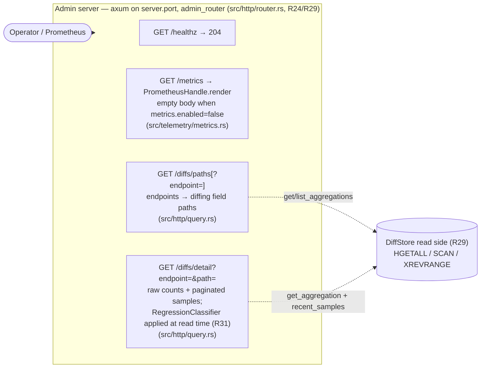

# Riffy — Runtime Architecture (DAG)

Riffy is a reverse proxy that detects statistical regressions between three
upstream deployments of the same service. Every request is answered from the
**baseline** upstream with zero analysis overhead; the **candidate** (new code)
and **control** (baseline replica) are called in the background, and their
responses are diffed against the baseline asynchronously. Fields where
baseline-vs-candidate disagreement (**raw**) significantly exceeds
baseline-vs-control disagreement (**noise**) are flagged as real regressions.

This document describes what the code *does today*. Where it deviates from
`Plan.md`, the deviation is recorded as a numbered revision (R#) in
`Progress.md`. To update this doc, use the `update-architecture-doc` skill in
`.claude/skills/`.

## Request & Analysis DAG

```mermaid
flowchart TD
    client(["Client"]) --> mw

    subgraph proxyserver ["Proxy server — axum on proxy.port (src/http/router.rs, R24)"]
        mw["track_proxy middleware<br/>resolve endpoint template once;<br/>drop-guard records count + duration<br/>exactly once — real status, or<br/>status=cancelled if dropped (R21)<br/>(src/telemetry/metrics.rs)"]
        guard{"mutating method and<br/>allow-http-side-effects=false?<br/>(src/http/forward.rs)"}
        mw --> guard
    end

    guard -- "yes" --> blocked(["405 Method Not Allowed<br/>(no upstream is contacted)"])

    subgraph hotpath ["HOT PATH — client-blocking; must never carry analysis work (R2)"]
        baseline["UpstreamClient.send → BASELINE<br/>reqwest, .no_proxy() (R18),<br/>hop-by-hop headers stripped<br/>(src/upstream/client.rs)"]
        resp(["Client response<br/>= baseline response, always (Q13/R3)"])
        guard -- "no" --> baseline --> resp
    end

    baseline -. "tokio::spawn — fire-and-forget" .-> fanout

    subgraph background ["Background task, one per request (src/http/forward.rs)"]
        fanout["tokio::join!<br/>CANDIDATE + CONTROL in parallel<br/>(src/upstream/client.rs)"]
        send["try_send AnalysisMessage<br/>bounded mpsc, capacity 1024;<br/>drop newest + warn when full (R12)<br/>(src/pipeline/mod.rs)"]
        fanout --> send
    end

    send --> recv

    subgraph consumer ["Analysis consumer — single task (src/pipeline/consumer.rs)"]
        recv["recv AnalysisMessage"]
        resolve["EndpointMatcher.resolve<br/>:param template match,<br/>else raw path, query stripped<br/>(src/endpoint/mod.rs)"]
        baselineparse["parse baseline body:<br/>decode_body — gzip / x-gzip / deflate(zlib) / br / zstd<br/>via async-compression (R20) — then JSON parse;<br/>unparseable → skip request<br/>(src/pipeline/decode.rs, consumer.rs)"]
        statuscheck{"per upstream:<br/>responded with same<br/>status as baseline? (R23)"}
        diff["parse body, then flatten_value:<br/>diff → flatten to dot-paths<br/>raw = baseline vs candidate<br/>noise = baseline vs control<br/>(src/compare/)"]
        nodiff["body not compared —<br/>empty diff map; a status mismatch<br/>is itself the signal (R23)"]
        record["DiffCounters.record<br/>DashMap + AtomicU64 counters:<br/>endpoint total, per-field raw / noise<br/>(src/analysis/counters.rs)"]
        decide{"any raw/noise diffs,<br/>or upstream status mismatch?"}
        entry["DiffEntry (R13)"]
        skip(["no stream entry —<br/>only counters moved"])
        recv --> resolve --> baselineparse --> statuscheck
        statuscheck -- "yes" --> diff --> record
        statuscheck -- "no / upstream failed" --> nodiff --> record
        record --> decide
        decide -- "yes" --> entry
        decide -- "no" --> skip

        ticker["interval ticker — buffer flush<br/>aggregation-interval (1s default) (R29/R31)<br/>+ one final flush on shutdown (R19)"]
        snapshot["collector.snapshot →<br/>raw counts per field, no classification<br/>(src/analysis/snapshot.rs)"]
        ticker --> snapshot
    end

    entry --> xadd
    snapshot --> hset

    subgraph store ["DiffStore trait (src/storage/mod.rs, R25) — RedisDiffStore (redis.rs) / InMemoryDiffStore, the default when redis config is absent (memory.rs, R29)"]
        xadd[("XADD riffy:diffs<br/>per-request diff entry")]
        hset[("HSET riffy:agg:{endpoint}<br/>raw counts only, pipelined, one RTT (R15/R31)")]
    end
```

Solid arrows are data flow within one request's lifecycle; the dotted arrow is
the only hand-off from the client-blocking path to async work. The graph is
acyclic: the ticker is an independent root, not a back-edge.

## Admin server (observability + query API)

The admin server carries `AdminState { metrics, store }` (R29); `FromRef`
hands each route only the substate it needs. The query API reads the same
`DiffStore` the consumer writes to, so it reflects the periodic aggregation
snapshots (staleness ≤ the aggregation interval) and the per-request stream.

The store persists **raw counts only** (R31); `is_regression` and the
relative/absolute percentages are derived in `diff_detail` at read time via
`RegressionClassifier` (held in `AdminState`), so changing a threshold
reclassifies everything instantly with no re-flush. Read methods on `DiffStore`
(analysis-side only, never the hot path): `get_aggregation` (HGETALL one
`riffy:agg:{endpoint}` hash), `list_aggregations` (cursor SCAN `riffy:agg:*` +
pipelined HGETALL), `recent_samples` (paged, newest-first XREVRANGE over
`riffy:diffs`, filtered to one endpoint + field path, `offset`/`limit`
paginated).

| Query route | Response |
|-------------|----------|
| `GET /diffs/paths` | `{ "endpoints": [ { endpoint, total, paths[], last_updated } ] }`, sorted by endpoint |
| `GET /diffs/paths?endpoint=<ep>` | one `{ endpoint, total, paths[], last_updated }`; 404 if unknown |
| `GET /diffs/detail?endpoint=&path=` | `{ endpoint, path, total, raw_count, noise_count, is_regression, relative_difference, absolute_difference, last_updated, samples }` (`is_regression`/percentages computed at read time from the stored counts); `samples = { items[], limit, offset, has_more }`, newest-first; 404 if nothing recorded for that endpoint+path. `limit` default 20 / max 100 |

| Metric | Labels | Emitted from |
|--------|--------|--------------|
| `riffy_proxy_request_total` | method, endpoint, status (HTTP code or `cancelled`) | `ProxyRequestGuard` in `track_proxy` |
| `riffy_proxy_request_duration_seconds` | method, endpoint | `ProxyRequestGuard` in `track_proxy` |
| `riffy_upstream_request_duration_seconds` | upstream (baseline/candidate/control), endpoint, outcome (`ok`/`error`/`cancelled`) | `UpstreamTimer` in `forward` + its background task |
| `riffy_diff_pipeline_lag_seconds` | — | consumer, after a diff entry is stored |
| `riffy_diff_fields_total` | endpoint, diff_type (raw/noise) | consumer, after a diff entry is stored |

Request and upstream timings are recorded by **drop guards** (R21): when a
future is dropped at an `.await` (client disconnect, shutdown, panic unwind),
the guard's `Drop` impl records the sample with `status="cancelled"` /
`outcome="cancelled"` instead of losing it. Duration histograms therefore
include abandoned requests (time until abandonment) and carry no survivorship
bias. Consumer-side metrics need no guard — they run in a detached task that
client cancellation cannot drop.

## Data written to Redis

**Stream entry** (`XADD riffy:diffs`), one per request that produced diffs or a
status mismatch:

| Field | Content |
|-------|---------|
| `endpoint` | resolved template (e.g. `/api/v1/users/:id`) or raw path |
| `timestamp` | RFC 3339 |
| `raw_fields` / `noise_fields` | JSON: `{ "<dot.path>": { "left"?, "right"?, "diff_type" } }` |
| `baseline_status` | always present |
| `candidate_status` / `control_status` | omitted when that upstream failed |

`diff_type` is one of `primitive`, `missing_field`, `extra_field`, `seq_size`,
`ordering`, `type_mismatch` (`src/compare/flatten.rs`).

**Aggregation hash** (`HSET riffy:agg:{endpoint}`), rewritten every
`redis.aggregation-interval`:

| Field | Content |
|-------|---------|
| `total` | requests analyzed for this endpoint |
| `fields` | JSON: `{ "<dot.path>": { "raw_count", "noise_count" } }` — raw counts only; `is_regression` is derived at read time (R31), not stored |
| `last_updated` | RFC 3339 (last buffer flush) |

## Invariants (do not regress)

1. **Hot path is sacred (R2):** nothing between "request received" and "baseline
   response returned" may block on, wait for, or compute analysis. Candidate
   and control calls, decoding, diffing, and Redis I/O all live behind
   `tokio::spawn` + the mpsc channel.
2. **The client always receives the baseline response (Q13/R3).** There is no
   response-mode configuration.
3. **Mutating methods (POST/PUT/PATCH/DELETE) are blocked before any upstream
   is contacted** unless `proxy.allow-http-side-effects` is set (Q11).
4. **A failed candidate/control must not poison counters:** absent or
   unparseable bodies contribute empty diff maps; an unparseable baseline skips
   the request entirely (not counted in totals).
   Statuses are checked before bodies (R23): a candidate/control that
   answered with a different status than baseline is reported as a status
   mismatch directly — its body is never decoded or compared.
5. **Backpressure sheds load, it never queues unbounded:** a full analysis
   channel drops the newest message with a warning (R12).
6. **Every tracked request/upstream call is recorded exactly once (R21):**
   completion records the real status/outcome; cancellation records
   `cancelled` via the guard's `Drop`. No code path may silently skip a
   metric sample.
